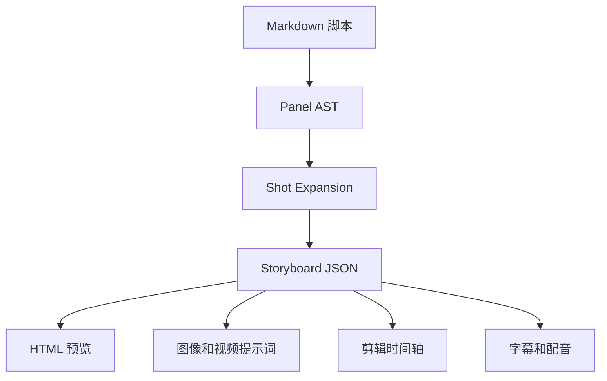
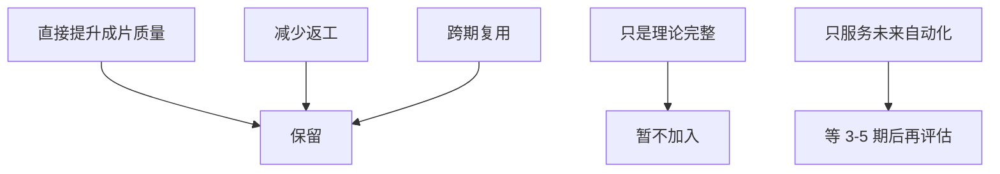

# Storyboard DSL 优化建议

本文根据 `chat2doc_导出文件_20260528_1118.pdf` 的结构级反馈，整理出适合本仓库当前阶段的优化空间。目标不是立刻把项目做成工程化编译器，而是把有价值的 DSL 思路转成「小白转行短剧个人工作室」能消化的下一步。

适合阅读对象：

- 想把 `episodes/*.md` 从「人类可读分镜」升级为「AI 更稳定理解的分镜输入」的人。
- 想继续做 000/001 这类短视频，但不想被 AST、编译器、自动化流水线过早拖住的人。
- 后续要决定是否新增 `docs/characters.md`、`docs/locations.md`、分镜表字段的人。

本轮只做分析，不修改 [TEMPLATE.md](../TEMPLATE.md)、[episodes/001-午休风波.md](../episodes/001-午休风波.md) 或 `production/` 下的实操文件。

## 1. PDF 反馈摘要

PDF 的核心判断是：当前项目已经不是普通「Markdown 漫画脚本」，而是非常接近 **AI-native storyboard DSL** 的雏形。它已经具备场景、角色、节奏、punchline、镜头意图和 UI 化叙事意识，但还停留在「人类可读」为主，机器可读程度不够稳定。

PDF 反复强调，AI 视频最怕长叙事，最吃以下结构：

- `scene`：发生在哪里。
- `beat`：这一段剧情的功能是什么。
- `shot`：每个镜头具体拍什么。
- `camera motion`：镜头如何运动。
- `character bible`：角色长什么样，跨镜如何保持一致。
- `emotion state`：角色情绪是什么，强度是多少。
- `audio cue`：声音如何驱动节奏。

PDF 指出的三个最关键缺口：

1. **camera language**：不能只写「手机屏幕特写」，应该显式拆成 `shot / angle / motion`。
2. **visual continuity**：不能只写「小职员」，应该给角色稳定 ID、发型、服装、道具和 prompt 锚点。
3. **emotion state**：不能只把情绪藏在文学描述里，应该写出表情类型和强度。

PDF 建议的双层结构是：

- 上层保留人类可读的分镜叙事。
- 下层增加 `[meta]` 或结构化字段，让 LLM 和视频模型稳定读取。

示意：

```yaml
[meta]
shot: close-up
angle: low
motion: push-in
duration: 3s
role: tension
emotion: { facial: annoyed, intensity: 4 }
```

PDF 还特别强调 **Panel ↔ Shot 1:N**：漫画格会压缩时间，视频镜头需要展开时间。比如「小职员惊醒」在漫画里可以是一格，但视频里可能需要拆成：

- 3A：噪音传来。
- 3B：小职员皱眉。
- 3C：睁眼。
- 3D：看向快递屋。

远期，PDF 建议的 pipeline 是：



这条路线很有启发，但对当前仓库来说，不能一次性全做。当前更合理的是：先吸收能直接提升成片稳定性的字段，不急着做 AST 和编译器。

PDF 对题材的判断也值得保留：`午休风波` 这种「职场荒诞宇宙 / 群聊驱动型 AI 剧场」非常适合 AI 短视频。原因是场景固定、运动少、UI 即剧情、punchline 信息密度高，AI 不需要处理战斗、群体调度、复杂动作等高风险内容。

## 2. 仓库现状对照

| PDF 反馈点 | 仓库现状 | 缺口 | 建议等级 |
|------------|----------|------|----------|
| 角色 ID + Bible | 出场角色段写了「身份描述模板」 | 无稳定 id，跨期不能复用 | L1 |
| Location preset | 场景设定每期重写 | 无 id，无 lighting/style 锚点 | L1 |
| `narrative_role` | 分镜叙事写了 establishing、冷场、反杀等隐含功能 | 未显式列入分镜单表 | L1 |
| `emotion_intensity` | 文学描述「眉头紧锁」「疲惫带怒」 | 无 1-5 或 1-10 量化 | L1 |
| `motion_intensity` | 自然语言写「轻微推近」「Dolly Zoom」 | 无 low/mid/high 标签 | L1 |
| `audio_cue` id | `cue-sheet.md` 已分类、有文件名 | 无短 id 给 AI 或剪辑复用 | L1 |
| camera 三元组 | 分镜单表已有「景别 / 视角 / 运镜」 | 字段名未对齐 `shot / angle / motion` | L1 |
| 双层 `[meta]` 块 | Markdown 表格已经半机器可读 | 没有 yaml 块给 LLM 直接喂 | L2 |
| Panel:Shot 1:N | 分镜叙事 ≈ panel；分镜单表 ≈ shot | 目前基本仍是 1:1 | L2 |
| AST / Compiler | 未做 | 不在小白阶段范围 | L3 |

一句话判断：仓库已经从「文学式脚本」进化到「半结构化 storyboard」，最值得补的是 **稳定 ID 和节奏标签**，不是立刻上工程链。

## 3. L1：立刻可补的字段

L1 的标准是：新增成本低，能直接提升 MJ、Runway、剪映执行稳定性。推荐下一轮优先落地。

### 3.1 角色 ID + Character Bible

推荐位置：`docs/characters.md`。

每个跨期角色或 archetype 维护一段稳定描述，episode 里只引用 `id`。这样做的价值是：同一个「小职员」「CEO」「快递小哥」不需要每期重写，也能稳定喂给 MJ 和 Runway。

示例：

```yaml
id: employee_01
role: 主角
archetype: tired office clerk
gender: male
age: 25-30
hair: short black hair, slightly messy
cloth: gray hoodie, white shirt
props: [office badge, smartphone]
emotion_base: tired, restrained, easily annoyed
mj_anchor: "young Asian male office clerk with glasses, gray hoodie, realistic, cinematic"
```

建议规则：

- `id` 用英文小写和数字，避免中文路径或工具解析问题。
- `mj_anchor` 写成可复制的英文 prompt 锚点。
- 不追求 Pixar 级角色一致性，先保证「同一类人不变成完全不同年龄/性别/风格」。

### 3.2 Location Preset

推荐位置：`docs/locations.md`。

场景库解决的是「每期都在重写办公室，但光线、布局、色调不稳定」的问题。职场荒诞题材最适合先建立固定 location。

示例：

```yaml
id: office_floor_5
name: 五楼大平层办公区
style: chinese internet company, open plan office
lighting: warm noon light, heavy window shadows
palette: low saturation, warm gray, muted yellow
props: [cubicle desks, monitors, office chairs, wall clock]
variants: [normal, lunch_break, freeze]
```

对 `午休风波` 来说，至少可以拆三个 location：

- `office_floor_5`
- `glass_mailroom`
- `company_group_chat_ui`

### 3.3 `narrative_role`

推荐位置：分镜语言单表新增 `role` 列。

它不是美术字段，而是节奏字段。AI 或剪辑执行时需要知道这一镜承担什么功能。

建议枚举：

| role | 含义 | 示例 |
|------|------|------|
| `setup` | 交代环境和人物 | 午休办公区全景 |
| `tension` | 制造冲突或压力 | 快递噪音、主角惊醒 |
| `pause` | 留白、等待、冷场 | 13:02 无人回复 |
| `punchline` | 反转或笑点 | CEO 回复 |
| `aftermath` | 反应、收束 | 切黑《全剧终》 |

对 001 可这样标：

| 场镜 | role |
|------|------|
| 1场1镜 | `setup` |
| 1场2镜 | `tension` |
| 1场3镜 | `tension` |
| 2场1镜 | `escalation` |
| 2场2镜 | `pause` |
| 2场3镜 | `punchline` |

### 3.4 `emotion_intensity`

推荐位置：分镜语言单表新增 `emotion` 或 `情绪强度` 列。

建议先用 1-5，不要一开始就 1-10。小白阶段不需要过细，过细反而增加判断成本。

示例：

| 强度 | 说明 | 示例 |
|------|------|------|
| 1 | 几乎无情绪 | 午睡同事 |
| 2 | 轻微疲惫或不适 | 深夜工位 |
| 3 | 明显烦躁 | 小职员被吵醒 |
| 4 | 压抑愤怒 | 群聊吐槽前 |
| 5 | 爆发或强 punchline | CEO 反杀时的压迫感 |

字段示例：

```yaml
emotion:
  facial: annoyed
  intensity: 4
```

### 3.5 `motion_intensity`

推荐位置：分镜语言单表新增 `motion_intensity` 列。

AI 视频最怕运动过度。单独标运动强度，可以提醒自己哪些镜头必须克制。

建议枚举：

| motion_intensity | 含义 | 示例 |
|------------------|------|------|
| `none` | 定格、截图、纯 UI | 群聊等待 |
| `low` | 静帧慢推、微弱呼吸感 | 午休全景 |
| `mid` | 缓慢推进、轻微 handheld | 玻璃快递房 |
| `high` | Dolly Zoom、突然微震 | 小职员惊醒、CEO 切黑 |

护栏：如果一个镜头不靠运动也能表达，就默认 `none` 或 `low`。

### 3.6 `audio_cue` id

推荐位置：`production/*/audio/cue-sheet.md` 或未来 `docs/audio-cues.md`。

当前 `cue-sheet.md` 已经有文件名，但缺少短 id。短 id 的价值是：在分镜表、HTML、字幕、剪映备注里都能稳定引用同一个声音。

示例：

```yaml
id: tape_rip
type: sfx
text: 尖锐撕胶带声
file: audio/sfx-tape-rip.mp3
dramatic_function: 打破午休安静
```

对 001 可先统一这些 id：

| cue_id | 说明 |
|--------|------|
| `office_ac_hum` | 空调低频环境 |
| `tape_rip` | 撕胶带 |
| `box_hit` | 纸箱落地 |
| `keyboard_typing` | 手机键盘 |
| `message_send` | 消息发送 |
| `clock_tick` | 冷场时钟 |
| `gavel_hit` | CEO 反杀重音 |

### 3.7 Camera 三元组字段名

仓库当前已有：

- 景别
- 视角
- 运镜

这已经很接近 PDF 要求。下一轮不用推翻，只需要让字段名更稳定：

| 当前字段 | 可对齐字段 | 示例 |
|----------|------------|------|
| 景别 | `shot_type` | `wide`, `close-up`, `macro` |
| 视角 | `angle` | `top-down`, `eye-level`, `low` |
| 运镜 | `camera_motion` | `static`, `push-in`, `dolly_zoom` |

推荐做法：保留中文列名，在列名里加英文括号，例如 `景别 shot_type`。这样人能看，模型也更稳定。

## 4. L2：半工程建议

L2 的标准是：能提高自动化能力，但会增加写作负担。建议等 000/001/002/003 连续跑完 3-5 期后再考虑。

### 4.1 双层 `[meta]` 块

当前仓库的 Markdown 表格已经半机器可读。如果马上引入每镜 yaml，会让创作负担变重。更好的方式是：把 `[meta]` 作为可选块，用在复杂镜头或未来自动化测试中。

示例：

```yaml
[meta]
shot: close-up
angle: low
motion: dolly_zoom
duration: 5s
role: tension
emotion: { facial: annoyed, intensity: 4 }
motion_intensity: high
character: [employee_01]
location: office_floor_5
audio: [tape_rip, office_ac_hum]
```

推荐规则：

- 简单镜头只填表，不写 `[meta]`。
- 复杂镜头、要交给自动化脚本的镜头，再补 `[meta]`。
- 不强制 yaml front matter，避免把写作变成填配置。

### 4.2 Panel:Shot 1:N

PDF 说「画格 = 镜头」是技术债，这点成立。但也不能所有格都拆，否则 30 秒短片会膨胀成 20 个镜头。

建议规则：

- 只有当一个漫画格内部存在明确时间变化，才拆成多个 shot。
- 只在 production 层或分镜语言层拆，不必改分镜叙事层。
- 拆分后仍保留原 panel id，方便回到故事结构。

以 `001` 的「小职员惊醒」为例：

| panel | shot | 内容 | 时长 | 作用 |
|-------|------|------|------|------|
| 第 3 格 | 3A | 噪音传来，主角眉头皱起 | 1s | tension |
| 第 3 格 | 3B | 一只眼睁开，表情烦躁 | 2s | reaction |
| 第 3 格 | 3C | 看向玻璃快递房 | 2s | decision |

但这只是示范。当前 001 已经有 6 镜，足够做第一条挑战片，不建议本轮重构成更多镜头。

## 5. L3：本阶段不做

PDF 的远期方向是正确的，但不适合当前阶段立刻投入。

本项目阶段不做：

- AST / parser / compiler 工程链。
- Storyboard JSON 多端渲染。
- Prompt Compiler / Shot Expansion 引擎。
- Premiere XML、AE JSX、自动剪辑时间轴导出。
- 强制 yaml front matter。
- Pixar 级角色一致性方案，如 LoRA 训练、IPAdapter 工作流固化。

原因很简单：这些是工具产品的工程投入，不是小白工作室第一阶段的成片投入。除非项目明确转向「AI 短剧引擎」产品化，否则 ROI 低。

当前更重要的是：

- 每周能稳定产出。
- 每期能复盘为什么某镜崩。
- 每个字段都服务于一个可见质量提升。

## 6. 推荐落地节奏

### 下一轮：只落地 L1

建议下一轮做这些：

1. 新增 `docs/characters.md`，建立跨期角色库。
2. 新增 `docs/locations.md`，建立跨期场景库。
3. `TEMPLATE.md` 分镜单表新增四列：`role`、`emotion_intensity`、`motion_intensity`、`cue_id`。
4. `episodes/000-MVP练手.md` 和 `episodes/001-午休风波.md` 同步填这四列。
5. `production/*/audio/cue-sheet.md` 给声音加稳定 `cue_id`。

这一步的收益最高：不需要写代码，但能显著提升 prompt 稳定性、剪辑复盘和跨期复用。

### 再下一轮：只试 L2 的一小部分

等连续做完 3-5 期后，再选择一个复杂镜头试 `[meta]` 块和 Panel:Shot 1:N。不要一次性全仓库迁移。

推荐试点：

- `001` 的 `1场3镜`：小职员惊醒。
- 或未来某期中包含「一个画格内连续动作」的镜头。

### L3：只有转产品时才启动

如果后续目标从「个人工作室产片」变成「AI 短剧引擎工具」，再考虑：

- Storyboard JSON schema。
- Markdown parser。
- Prompt compiler。
- HTML / SRT / timeline 多端导出。

这条路可以保留为远期愿景，但不要绑架当前制作流程。

## 7. 决策护栏

每次想新增字段前，先问三个问题：

1. 这个字段能不能让某一个镜头更容易生成？
2. 这个字段能不能减少某一种常见返工？
3. 这个字段能不能被剪映、MJ、Runway 或人工复盘直接使用？

如果不能清楚回答，就先不加。

字段优先级应当是：



最终判断：PDF 给的方向是对的，但当前仓库不应该马上从「短剧制作工作台」跳成「DSL 工程项目」。最优路径是先补 L1 字段，让 `comic_daily` 继续围绕职场荒诞短剧稳定产出；等真实生产样本足够多，再抽象成 Storyboard AST。
