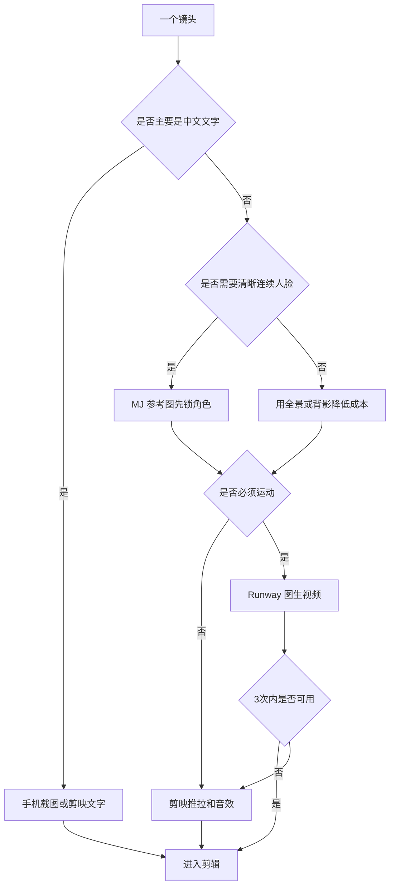

# 短剧短视频制作指南

这份指南把每期脚本从 Markdown 推到可发布短视频。默认工具链：DeepSeek、Midjourney、Runway、剪映。

## 目录约定

每期 production 目录采用统一结构：

```text
production/{三位序号}-{短标题}/
├── storyboard.html
├── stills/
│   ├── 1场1镜.png
│   └── 1场1镜-v2.png
├── clips/
│   └── 1场1镜.mp4
├── audio/
│   ├── bgm-office-ambient.mp3
│   └── sfx-message-send.mp3
└── export/
    ├── {三位序号}-{短标题}-draft.mp4
    └── {三位序号}-{短标题}-final.mp4
```

`episodes/*.md` 是单一可信源，`storyboard.html` 是导演预览页，`production/` 只存素材和导出。

## 标准 SOP

| 步骤 | 动作 | 输入 | 输出 | 通过标准 |
|------|------|------|------|----------|
| 1 | 定稿剧本 | 灵感、梗概 | `episodes/*.md` | 一句话梗概有反转 |
| 2 | 拆分场镜 | 分镜叙事 | 分镜语言单表 | 每镜有时长、i2v 决策、风险 |
| 3 | 生成静帧 | MJ 提示词 | `stills/*.png` | 构图清楚，人物不崩 |
| 4 | 生成单镜视频 | 静帧 + i2v 控制 | `clips/*.mp4` | 不融化、不乱动 |
| 5 | 做声音 | 声音设计表 | `audio/*` 或剪映音轨 | 音效服务节奏 |
| 6 | 剪映合成 | clips/stills/audio | draft 成片 | 30 秒内，字幕可读 |
| 7 | 审核导出 | 审核清单 | final 成片 | 手机端预览通过 |

## DeepSeek 提示词

```text
你是短剧短视频分镜导演。请把下面故事拆成 3-6 个镜头。
要求：
1. 每个镜头只承担一个叙事功能。
2. 标出景别、视角、运镜、时长、是否需要 i2v。
3. 对每镜写 MJ 提示词、Runway i2v 控制、声音设计、避坑风险。
4. 能用手机截图/字幕解决的镜头，不要强行使用 AI 视频。

故事：
{粘贴故事}
```

## Midjourney 提示词模板

```text
{主体人物/场景}, {动作或状态}, {景别}, {视角}, {光线}, {情绪}, modern Chinese workplace, cinematic composition, photorealistic / clean comic style, consistent character design, no text, no watermark --ar 16:9 --sref {风格参考}
```

建议：

- 全景镜头不要求清晰人脸，降低一致性成本。
- 角色近景先出一张最满意的主角种子图，后续复用为参考图。
- 手机群聊、标题字幕、时间戳优先用真实截图或剪映文字，不让 MJ 生成中文。

## Runway i2v 控制模板

```text
Keep the original composition and character identity.
Camera: {static / slow push in / micro handheld / dolly zoom}.
Motion: {subtle breathing / dust floating / message bubble pop-up / freeze frame}.
Avoid: distorted hands, face morphing, extra people, unreadable text, large body movement.
Duration: {4s}.
```

图生视频原则：

- 只让画面动一点，不让角色做复杂表演。
- 群聊 UI 镜头用剪映做弹出动画，不用 Runway 生成中文。
- 如果 3 次仍然融化，改成静帧推拉、定格或音效转场。

## 剪映工作流

1. 建 9:16 或 16:9 项目，按分镜表导入素材。
2. 先按时间轴排静帧和 clips，不加特效。
3. 加 BGM 和 SFX，确保冲突点、冷场点、反杀点有声音变化。
4. 加字幕和群聊截图，所有中文必须手机端可读。
5. punchline 后保留 1 秒以上静默或黑屏。
6. 导出 draft，手机端看一遍，再导出 final。

## 工具决策树



## 审核清单

- [ ] 片头 3 秒内交代地点、人物或冲突。
- [ ] 每个镜头时长与台词字数匹配。
- [ ] 角色近景跨镜不跳脸。
- [ ] 手部、中文、UI 没有交给 AI 硬生成。
- [ ] 关键音效不遮住台词和字幕。
- [ ] 群聊文案与脚本一致。
- [ ] 末尾反转后有停顿或切黑。
- [ ] `stills/`、`clips/`、`audio/`、`export/` 文件命名与场镜一致。

## 失败降级方案

| 失败点 | 降级 |
|--------|------|
| 人脸不一致 | 改背影、剪影、全景或固定头像 |
| 手部动作崩 | 改道具特写 + 音效 |
| 中文不可读 | 全部换成剪映字幕或真实截图 |
| i2v 融化 | 静帧推拉、定格、闪白、切黑 |
| 节奏拖 | 删除解释镜头，只保留冲突和反转 |
