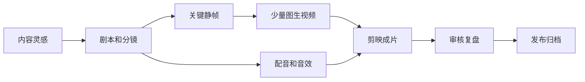

# 内容到短剧短视频可行性方案

本仓库按「小白转行短剧个人工作室」来设计：先用低成本流程跑通 15-30 秒短视频，再逐步提高镜头复杂度。条漫是静帧副产品，不是主线目标。

## 一句话路线

DeepSeek 写剧本和分镜，Midjourney 出关键静帧，Runway 做少量图生视频，剪映完成声音、字幕、节奏和导出。

## 阶段目标

| 阶段 | 目标 | 适合题材 | 成功标准 |
|------|------|----------|----------|
| 第 1 周 | 跑通 3 镜 MVP | 单人独白、吐槽、反转金句 | 15 秒内成片，文字清楚，节奏不拖 |
| 第 2-4 周 | 稳定 6 镜短剧 | 办公室、家庭、校园轻冲突 | 一周 1 条，返工不超过 2 轮 |
| 第 2 月 | 建立角色资产库 | 固定主角、固定场景 | 同一角色跨镜不跳脸 |
| 第 3-4 月 | 扩展系列化 | 连续 IP、固定栏目 | 形成可复用模板和发布节奏 |

## 推荐工具链

| 环节 | 主工具 | 备选 | 关键理由 |
|------|--------|------|----------|
| 剧本/分镜 | DeepSeek | GPT、Kimi | 快速生成冲突、反转和分镜表 |
| 静帧 | Midjourney | 即梦、可灵、LiblibAI | 风格稳定，适合做主视觉和角色锚点 |
| 图生视频 | Runway | Pika、PixVerse、即梦 | 用于少数关键运动镜头，不承担全部制作 |
| 剪辑 | 剪映 | CapCut、Premiere | 字幕、音效、手机预览成本低 |
| 音频 | 剪映配音/素材库 | ElevenLabs、Suno | 小白阶段先用现成音效，升级后再精修 |

## 三类案例共性

| 类型 | 共性 | 不同点 | 小白取法 |
|------|------|--------|----------|
| 职场反转 | 开头环境清楚，结尾靠一句话反杀 | 有的靠群聊，有的靠真人表情 | 优先做群聊/字幕反转，少做人脸连续动作 |
| 氛围短片 | 先用声画建立情绪，再用一个动作破局 | 对镜头质感要求更高 | 用静帧 + 音效骗动感，减少复杂运动 |
| 自动化流水线 | 文案、图像、音频、视频可串联 | 初期搭建成本高 | 先人工跑通，再把重复字段交给自动化 |

## 关键节点和问题

| 节点 | 常见问题 | 解决思路 |
|------|----------|----------|
| 选题 | 梗太大、镜头太多 | 限制为 1 个冲突、1 个反转、3-6 镜 |
| 分镜 | 每镜信息过载 | 每镜只承担一个功能：交代、激化、等待、反杀 |
| 出图 | 人脸不一致、手部崩坏 | 全景不看脸；手部动作改为道具/音效表达 |
| 图生视频 | 运动融化、人物漂移 | 只动镜头或氛围，不让 AI 表演复杂动作 |
| 群聊/文字 | AI 生成文字不可读 | 手机截图或剪映字幕直接做，0 成本且清晰 |
| 音频 | BGM 抢台词 | punchline 前降噪，最后一句后留 1 秒静默 |
| 导出 | 手机端看不清 | 先在手机预览，检查 9:16 字号和安全边距 |

## MVP 标准

第一周只做 `episodes/000-MVP练手.md` 这种 3 镜结构：

| 镜头 | 功能 | 建议做法 |
|------|------|----------|
| 1 | 交代人物和处境 | 一张稳定静帧 + 旁白 |
| 2 | 抛出冲突 | 轻微推近或字幕弹出 |
| 3 | 反转金句 | 定格 + 重音 + 切黑 |

MVP 不追求复杂动作，不追求角色连续表演，只验证「选题、分镜、声音、剪辑」是否闭环。

## 001 的难度判断

`001-午休风波` 是 **★★★ 挑战关**，原因：

- 有办公室、玻璃快递房、群聊三个核心场景。
- 有环境噪音、人物惊醒、群聊冷场、CEO 反杀多个节奏点。
- 人物动作如果全交给 AI，容易出现手部、表情和角色一致性问题。

所以 001 的可行做法是：办公室三镜用 MJ + Runway；群聊两镜用手机截图/剪映；最后 CEO 反杀可用截图 + 震动 + 切黑完成。

## 成本护栏

| 项目 | 上限 | 超出后处理 |
|------|------|------------|
| 单镜出图 | 8 次以内 | 换构图，不继续修同一提示词 |
| 单镜图生视频 | 3 次以内 | 改成静帧推拉或定格 |
| 单条短片时长 | 30 秒以内 | 删除铺垫镜头 |
| 单条制作时间 | 1-2 天 | 降级为条漫或静帧视频 |
| 单期工具预算 | 先控制在 50 元以内 | 优先手机截图、剪映内置素材 |

## 复盘清单

- [ ] 观众 3 秒内知道发生在哪里。
- [ ] 每个镜头只有一个叙事任务。
- [ ] 文字信息在手机上可读。
- [ ] punchline 前有停顿，后有留白。
- [ ] 哪些镜头其实可以不做 i2v 已被标记。
- [ ] 失败原因写回下一期模板，而不是只重做素材。
